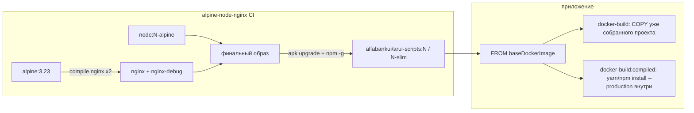

# Оптимизация `alpine-node-nginx` и ускорение Docker-сборок приложений

Разбор пакета [`packages/alpine-node-nginx`](https://github.com/core-ds/arui-scripts/tree/master/packages/alpine-node-nginx)
в `core-ds/arui-scripts` (актуальный `master` на 2026-08-22) и того, как приложения
собирают свои образы командами `arui-scripts docker-build` / `docker-build:compiled`.

Цель: ускорить **сборку образов приложений**. Сборка самого базового образа важна
потому, что она определяет размер/digest `FROM` и то, попадает ли слой базового
образа в кэш CI приложений.

---

## Коротко

Самый большой выигрыш для приложений даёт не более быстрый `make nginx`, а
**стабильный digest тега** и **меньший pull**.

Сейчас каждую ночь cron пересобирает и перезаписывает те же теги
(`22.22.0`, `22.22.0-slim`, …). В финальном stage есть `apk upgrade` и
`npm install -g npm`, поэтому digest меняется даже при неизменных Node/nginx.
Любой `FROM alfabankui/arui-scripts:22.22.0-slim` в CI приложения каждый день:

1. заново качает ~75–83 MB;
2. инвалидирует **все** последующие слои Dockerfile.

Дополнительно базовый образ каждый раз компилирует nginx **из исходников дважды**
и делает это **отдельно для каждой версии Node** (6 полных компиляций за прогон),
без кэша Buildx.

Ожидаемый эффект, если внедрить рекомендации ниже:

| Изменение | Эффект на сборку приложений | Эффект на сборку базы |
|---|---|---|
| Неподвижные теги / rebuild только при изменении | минус ежедневный re-pull и полный cache miss | реже и быстрее CI |
| Убрать `npm i -g npm` и `nginx-debug` | меньше ~5–15 MB на pull | быстрее финальный stage |
| Один `make`, общий nginx-builder + GHA cache | косвенно (свежие теги появляются быстрее) | компиляция nginx 1 раз вместо 6 |
| Alpine-пакеты `nginx` + `nginx-mod-http-brotli` | чуть меньше образ, проще CVE-фиксы | база собирается за минуты, не за десятки |
| BuildKit cache mount в `docker-build:compiled` | минуты на `yarn install` при тёплом кэше | — |

Готовые файлы лежат в [`patches/alpine-node-nginx-optimizations/`](../patches/alpine-node-nginx-optimizations/README.md).

---

## Как устроен контур



Базовый образ — runtime для приложений: Node + nginx с brotli/`gzip_static` +
`envsubst`. Приложение само по себе nginx не собирает.

Два пути сборки приложения:

- `docker-build` — `npm run build` на хосте, prune `devDependencies`, затем
  `ADD` всего проекта в образ. Базовый образ используется как runtime.
- `docker-build:compiled` — в образ кладутся lockfile/manifest, внутри
  ставится production-зависимости, затем копируется уже собранный `.build`.
  Это основной путь для CI.

Шаблон приложения (`dockerfile.template.ts` / `dockerfile-compiled.template.ts`)
делает только `FROM ${configs.baseDockerImage}` и копирует артефакты.
Скорость `docker build` приложения почти целиком определяется:

1. временем `docker pull` базового образа;
2. попадет ли слой `FROM` в кэш;
3. (для compiled) скоростью `yarn/npm install` внутри контейнера.

---

## Текущие размеры и частота публикации

Данные Docker Hub на 2026-08-22:

| Тег | Сжатый размер | Последнее обновление |
|---|---:|---|
| `22.22.0` | 82.8 MB | сегодня 03:49 UTC |
| `24.14.1` | 82.0 MB | сегодня 03:48 |
| `26.7.0` | 86.5 MB | сегодня 03:48 |
| `22.22.0-slim` | 74.7 MB | сегодня 03:48 |
| `24.14.1-slim` | 73.8 MB | сегодня 03:48 |
| `26.7.0-slim` | 78.3 MB | сегодня 03:48 |
| `nginx-1.27.1-slim` | 8.7 MB | сегодня 03:47 |
| `node:22.22.0-alpine3.23` (upstream) | 54.1 MB | январь 2026 |

Надбавка кастомного nginx + openssl + глобального npm к официальному
`node:*-alpine` — **~20–29 MB**. Slim экономит только ~8 MB относительно full.

Дефолт приложений уже не `latest` (он заморожен), а
`alfabankui/arui-scripts:24.10.0-slim` — тег от октября 2025, хотя актуальный
slim для Node 24 — `24.14.1-slim`.

---

## Что тормозит сборку образов приложений

### 1. Ежедневный пересбор тех же тегов — главный cache killer

Воркеры:

- [`.github/workflows/alpine-node.yml`](https://github.com/core-ds/arui-scripts/blob/master/.github/workflows/alpine-node.yml)
  — cron `0 3 * * *` + push в `packages/alpine-node-nginx/**`;
- [`.github/workflows/alpine-nginx-slim.yml`](https://github.com/core-ds/arui-scripts/blob/master/.github/workflows/alpine-nginx-slim.yml)
  — то же.

На `master` тег **не** содержит SHA:

```yaml
if [ "${{ steps.git_info.outputs.is_master }}" = "true" ]; then
  echo "final_tag=${{ matrix.versions.tag }}"
```

Финальный stage каждый раз делает:

```dockerfile
apk update
apk upgrade --no-cache
apk add --no-cache --upgrade openssl libcrypto3 libssl3
npm install -g npm
```

Это слои с «сегодняшним» индексом apk и «сегодняшним» npm. Digest тега
`22.22.0-slim` меняется каждую ночь, даже если Dockerfile и версия Node
не менялись.

Для приложения:

```dockerfile
FROM alfabankui/arui-scripts:22.22.0-slim
```

Docker считает базовый слой новым → кэш всех `ADD`/`RUN` после `FROM`
сбрасывается. В корпоративном CI без локального layer cache это ещё и
полный повторный pull.

**Что делать**

1. Пересобирать и пушить плавающий тег (`22.22.0-slim`) только если
   изменился Dockerfile, версия Node/Alpine/nginx или есть CVE-bump.
2. Для nightly security-rebuild публиковать **неподвижный** тег:
   `22.22.0-slim-20260822` и/или digest.
3. В приложениях пинить digest:
   `alfabankui/arui-scripts:24.14.1-slim@sha256:…`.
4. Убрать ежедневный `apk upgrade` + `npm i -g npm` из «горячего» пути.
   Обновления безопасности — отдельным контролируемым релизом.

Cron можно оставить как *проверку*, но пушить поверх того же тега —
только при реальном diff.

### 2. В базовый образ кладут то, что приложениям не нужно

`npm install -g npm` в runtime-образе:

- увеличивает размер (~несколько MB + слои);
- делает digest недетерминированным;
- противоречит флагу приложений `deleteNpm`, который потом вычищает
  `/usr/local/bin/npm`, `npx` и `node_modules/npm`.

Приложениям npm в рантайме не нужен: `docker-build` ставит зависимости
на хосте, `docker-build:compiled` использует yarn из `.yarn/releases`
(через symlink) или npm из самого Node.

`nginx-debug` копируется в финальный образ, хотя в шаблоне `start.sh`
запускается обычный `nginx`. Бинарник — не debug-сборка (см. ниже),
просто второй `nginx`.

**Что делать:** не обновлять npm глобально; не копировать `nginx-debug`;
по возможности выставлять `deleteNpm: true` по умолчанию для runtime.

### 3. `docker-build:compiled` каждый раз ставит зависимости с нуля

Шаблон:

```dockerfile
ADD package.json yarn.lock .yarnrc.yml .yarn /src/
RUN ln -sf /src/.yarn/releases/... /usr/local/bin/yarn && \
    yarn workspaces focus --production --all && \
    yarn cache clean --all
ADD --chown=nginx:nginx . /src
```

Проблемы:

- нет `RUN --mount=type=cache` для yarn/npm — кэш пакетов вычищается
  `yarn cache clean --all` и не переживает сборку;
- `getDockerBuildCommand()` вызывает голый `docker build` без
  `--cache-from` / `--build-arg BUILDKIT_INLINE_CACHE=1`;
- `ADD --chown=nginx:nginx . /src` на большом контексте делает chown
  всего дерева в одном слое — это часто дольше, чем сам copy;
- `ADD` вместо `COPY` лишний раз сбивает ожидания кэша (ADD умеет URL/tar).

**Что делать в arui-scripts** (это уже не образ, а генератор Dockerfile):

```dockerfile
COPY package.json yarn.lock .yarnrc.yml .yarn /src/
RUN --mount=type=cache,target=/usr/local/share/.cache/yarn \
    --mount=type=cache,target=/root/.npm \
    ln -sf /src/.yarn/releases/yarn-x.cjs /usr/local/bin/yarn && \
    yarn workspaces focus --production --all
COPY --chown=nginx:nginx . /src
```

И в `getDockerBuildCommand`:

```bash
DOCKER_BUILDKIT=1 docker build \
  --cache-from type=registry,ref=$imageFullName \
  --build-arg BUILDKIT_INLINE_CACHE=1 \
  ...
```

`chown` лучше делать один раз в конце и только на нужные пути
(`/src`, `/var/lib/nginx`, pid), либо собирать под `USER nginx` с
`COPY --chown` точечно, без повторного `chown -R` после полного `ADD .`.

### 4. Обычный `docker-build` тащит весь контекст, включая `node_modules`

После prune на хосте в образ всё равно копируется `.` (кроме того, что
в `.dockerignore`). Если ignore слабый — в контекст попадают тесты,
`.git`, coverage, локальные кэши. Это медленный upload контекста в
Docker daemon, не вина базового образа, но именно так приложения
собирают артефакт.

`docker-build:compiled` уже дописывает `node_modules` в `.dockerignore` —
этот путь нужно считать основным в CI.

### 5. Дефолтный тег отстаёт, `latest` мёртв

README честно пишет: `latest` больше не обновляется. Дефолт в
`get-defaults.ts` — `24.10.0-slim`. Новые приложения тянут старый
базовый слой, пока явно не пропишут `24.14.1-slim`.

Имеет смысл либо автоматически подтягивать актуальный slim в дефолтах
при релизе образа, либо задокументировать, что `baseDockerImage`
обязан быть явным в каждом проекте.

---

## Что тормозит сборку самого базового образа

Это важно, потому что сейчас любое касание Dockerfile вечером гоняет
полную матрицу, а cron делает то же самое каждую ночь.

### 6. Nginx собирается из исходников дважды и без `--with-debug`

Фрагмент из `Dockerfile` / `Dockerfile-slim`:

```dockerfile
./configure $NGINX_CONFIG
make -j$(getconf _NPROCESSORS_ONLN)
mv objs/nginx objs/nginx-debug
./configure $NGINX_CONFIG
make -j$(getconf _NPROCESSORS_ONLN)
```

Оригинал [fholzer/docker-nginx-brotli](https://github.com/fholzer/docker-nginx-brotli)
в первом проходе передаёт `--with-debug`. Здесь флаг сняли (из-за GCC 15 /
Alpine 3.23), но второй `./configure && make` оставили. `nginx-debug` —
байт-в-байт тот же бинарник, что и `nginx`. Компиляция удваивается впустую.

Дальше оба бинарника копируются в runtime.

### 7. Одна и та же сборка nginx повторяется на каждую версию Node

Матрица `alpine-node.yml`:

```text
Dockerfile      × node 22 / 24 / 26
Dockerfile-slim × node 22 / 24 / 26
```

Стадия сборки nginx **не зависит от Node**. Для Alpine 3.23 full и slim
можно собрать nginx **по одному разу** и `COPY --from` в три Node-образа.
Сейчас 6 независимых компиляций. Кэша Buildx в workflow нет вообще
(`docker/build-push-action@v5` без `cache-from`/`cache-to`).

`alpine-nginx-slim.yml` всё ещё на `actions/checkout@v2` и
`docker/build-push-action@v1`.

### 8. Alpine уже содержит nginx + brotli

В Alpine 3.23:

- `nginx` **1.28.3-r7** (новее, чем зашитый `1.27.1`);
- `nginx-mod-http-brotli` в main.

Компиляция из исходников была оправдана, когда в Alpine не было brotli.
Сейчас полный builder (gcc, cmake, git, два `make`, gpg-проверка) —
десятки минут CI ради модуля, который ставится одной строкой:

```dockerfile
apk add --no-cache nginx nginx-mod-http-brotli gettext tzdata
```

Оговорки, если переходить на пакеты:

- в `nginx.conf` понадобится `load_module` для brotli (сейчас модуль
  влинкован статически);
- uid/gid nginx должны остаться **100/101** (требование ДКБ / k8s) —
  пользователя лучше создать *до* `apk add` или поправить после;
- slim сейчас **без HTTP/2** (`Dockerfile-slim` не передаёт
  `--with-http_v2_module`, в отличие от `Dockerfile` и
  `Dockerfile-nginx-slim`). Пакетный nginx HTTP/2 обычно включает.
  Для приложений это почти безразлично: они слушают `:8080` без TLS,
  HTTP/2 терминируется на ингрессе;
- `gzip_static` и `brotli_static` в пакетном nginx есть, шаблоны
  `base-nginx.conf` / `nginx.conf` приложений на них завязаны
  (`brotli on`, `gzip_static on`, опционально `brotli_auto_dictionary`).

Пакетный путь — самый большой выигрыш по времени сборки базы.
Если нужна побитовая совместимость с текущим бинарником, достаточно
инкрементального варианта: оставить compile, но один раз и с кэшем.

### 9. Мелочи Dockerfile, которые множат слои и ломают кэш

- Два отдельных `apk add --virtual` (build-deps и brotli-deps) — лишний
  слой и повторный индекс пакетов.
- `COPY nginx.conf` и сразу `ADD nginx.conf /etc/nginx/` — один и тот же
  файл дважды, второй раз через `ADD`.
- Стадии без имён (`COPY --from=0`) — хуже читается и мешает шарить
  builder между job.
- `SHELL ["/bin/bash", "-x", "-c"]` тащит bash в builder только ради
  трассировки.
- В slim всё равно ставится `openssl libcrypto3 libssl3`, хотя README
  slim обещает избавиться от openssl и связанных CVE. Для приложений
  без TLS внутри контейнера эти пакеты не нужны.
- `ARG NODE_VERSION=latest` в Dockerfile — опасный дефолт; в CI версия
  задаётся явно, локально легко собрать «не то».

---

## Рекомендуемый порядок внедрения

Безопасно и по возрастанию риска.

### Этап A — без смены runtime-поведения (делать сразу)

1. Собрать nginx **один** раз, не копировать `nginx-debug`.
2. Удалить дубль `ADD nginx.conf`.
3. Убрать `npm install -g npm` из базового образа.
4. Не делать `apk upgrade` на каждый билд; security-bump — отдельным
   коммитом/тегом.
5. Включить GHA cache (`type=gha`, `mode=max`) и общий nginx-builder
   на матрицу Node.
6. Публиковать неподвижный суффикс даты/SHA; плавающий тег двигать
   только при изменении содержимого.
7. Починить `alpine-nginx-slim.yml` до Buildx v3/v5, как основной workflow.

Ожидание: nightly больше не сбрасывает кэш приложений; pull чуть легче;
сборка базы ускоряется в разы за счёт кэша и одного `make`.

### Этап B — шаблоны приложений в `arui-scripts`

1. `COPY` вместо `ADD`.
2. `RUN --mount=type=cache` для yarn/npm в compiled-шаблоне, без
   обязательного `yarn cache clean --all`.
3. `DOCKER_BUILDKIT=1` + `--cache-from` в `getDockerBuildCommand`.
4. Обновить дефолт `baseDockerImage` на актуальный slim
   (`24.14.1-slim` на момент разбора).
5. В CI проектов использовать `docker-build:compiled` и пин digest.

### Этап C — пакетный nginx (отдельный major/minor образа)

Новый Dockerfile без компиляции, тег например `24.14.1-slim-pkg`.
Прогнать на example-приложении: `gzip_static`, brotli, `envsubst` в
`start.sh`, uid 100, `runFromNonRootUser`, dictionary compression.

Если example и 1–2 боевых сервиса зелёные — сделать пакетный slim
дефолтом, compile оставить только для full (если full ещё кому-то нужен).

---

## Что трогать не стоит без нужды

- Кастомный `ngx-brotli-cdt` (`heymdall-legal/ngx-brotli-cdt`) нужен для
  `brotli_auto_dictionary` (compression dictionary). Пакетный
  `nginx-mod-http-brotli` из Alpine — обычный ngx_brotli, **без** этой
  доработки. Пока фича используется, compile-путь для словаря надо
  сохранить отдельным тегом или собирать только этот модуль как
  dynamic module.
- uid `100` / gid `101` — требование ДКБ, не менять.
- `envsubst` обязан остаться: `start.sh` подставляет env в nginx.conf.
- slim без SSL — правильное решение для in-cluster HTTP за ингрессом.

---

## Итог

Узкое место сборки **приложений** — не gcc в базовом образе, а то, что
базовый образ каждую ночь притворяется новым. Сначала нужно сделать
теги воспроизводимыми и перестать класть в runtime npm/debug-nginx.
Параллельно имеет смысл перестать компилировать nginx шесть раз за ночь
и (отдельным шагом) заменить compile на Alpine-пакеты там, где не нужен
`brotli_auto_dictionary`.

После этого ускорение `docker-build:compiled` упрётся уже в установку
зависимостей — это лечится cache mount и registry cache в генераторе
Dockerfile, а не новым слоем в `alpine-node-nginx`.
